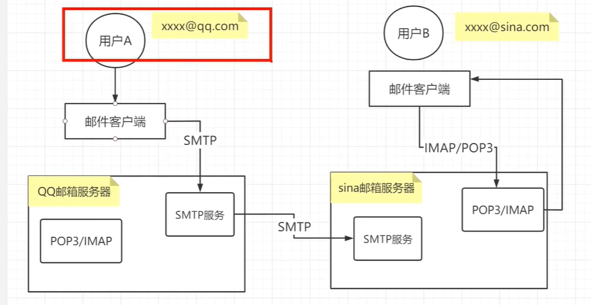
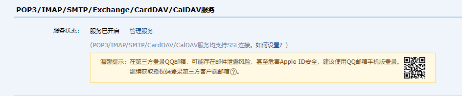

# 邮件系统

## 相关协议

### SMTP

SMTP的全称是“Simple Mail Transfer Protocol”，即简单邮件传输协议 (25号端口)
它是一组用于从源地址到目的地址传输邮件的规范，通过它来控制邮件的中转 属于“推送”协议

### IMAP

IMAP全称是Internet Mail Access Protocol，即交互式邮件访问协议，是一个应用层协议 (端口是143)用来从本地邮件客户端(Outlook
Express、Foxmail、MozillaThunderbird等)
访问远程服务器上的邮件 属于“拉取”协议。

### POP3

POP3是Post Office Protocol 3的简称，即邮局协议的第3个版本是TCP/IP协议族中的一员
(默认端口是110)本协议主要用于支持使用客户端远程管理在服务器上的电子邮件 属于“拉取”协议

### POP3与IMAP的区别

两者均为“拉取”型协议，负责从邮件服务器中 下载邮件·IMAP 具备 摘要浏览功能，可预览部分摘要，再下载整个邮件IMAP
为双向协议，客户端操作可反馈给服务器 ·POP3必须下载全部邮件，无摘要功能 ·POP3
为单向协议，客户端操作无法同步服务器。

### 对应的过程

> 

Django重点关注SMTP部分，也就是如何将对应的邮件发送到指定的用户。

## Django发送邮箱

1. 申请QQ账号
2. QQ邮箱授权
   点击设置,点击账户,选择开启POP3/SMTP服务。如下：
   
3. 拿到授权码
4. 在settings.py中进行对应的配置

```pycon
# 发送邮件配置
EMAIL_BACKEND = 'django.core.mail.backends.smtp.EmailBackend'
# smpt服务地址
EMAIL_HOST = 'smtp.qq.com'
EMAIL_PORT = 25  # 端口默认都是25不需要修改
# 发送邮件的邮箱，需要配置开通SMTP
EMAIL_HOST_USER = 'xxxx@qq.com'
# 在邮箱中设置的客户端授权密码
# 此处的EMAIL_HOST_PASSWORD是用QQ邮箱授权码登录
EMAIL_HOST_PASSWORD = 'xxxx'
# 收件人看到的发件人
EMAIL_FROM = 'xxxx@qq.com'
```

5. 调用Django内置的函数

```pycon
from django.core import mail
def cache_test(request):
    mail.send_mail(
        subject='邮件标题',
        message='邮件消息',
        from_email='xxxx@qq.com' # 发送者,默认为当前配置的邮箱
        recipient_list=['xxx@qq.com']  # 接收者列表
    )
    return  HttpResponse('发送成功')
```
