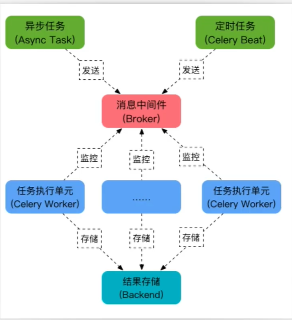

# Celery结合Django

## 验证码功能的实现

1. 注册容联云,获取对应`AUTH＿TOKEN`,查看接入文档

```pycon
对应接入指南：https://doc.yuntongxun.com/p/5a531a353b8496dd00dcdfe2
```

2. 使用容联通云sdk

```pycon
# pip install pip install ronglian_sms_sdk
# 初始化SDK
sdk = SmsSDK(accId, accToken, appId)
#  调用发送短信方法,data为元组,是需要传递到短信模板中的数据
sdk.sendMessage(tid, mobile, datas)
```

3. 验证码功能的流程  
   发送Ajax请求到后端1，前端页面 点击“免费获取验证码"后端接到请求后  
   1,生成随机验证码  
   2,存储验证码  
   3,发送验证码  
   注册时，需要提交验证码，并在注册逻辑中对比验证码是否正确。
4. 完成前端代码:

```html
<!DOCTYPE html>
<html lang="en">
<head>
    <meta charset="UTF-8">
    <title>发送短信</title>
    <link href="https://cdn.jsdelivr.net/npm/bootstrap@5.3.0-alpha1/dist/css/bootstrap.min.css" rel="stylesheet">
    <script src="https://cdn.bootcdn.net/ajax/libs/jquery/3.7.1/jquery.js"></script>
</head>

<body>
<div class="modal-body">
    <form class="container" id="loginform">
        <div class="form-group row">
            <div class="col-sm-1"></div>
            <label class="col-sm-3 col-form-label">短信验证</label>
            <div class="col-sm-7">
                <div class="input-group input-group-sm">
                    <input type="text" class="form-control" id="captcha" name="captcha">
                    <span class="input-group-append">
                                        <button type="button" class="btn btn-info btn-flat" id="captchabtn"
                                                onclick="sendcaptcha()">发送验证码</button>
                                    </span>
                </div>
            </div>
        </div>
    </form>
    <!-- /.card-body -->
</div>
<div class="modal-footer justify-content-between">
    <div id="loginerror" class="text-danger"></div>
    <button type="button" class="btn btn-info" onclick="login()">注册账号</button>
</div>

<script>
    /* 倒计时效果函数 */
    function SmsTimer() {
        // 将标签设置为不可点击的
        // jquery 的变量一般以 $ 开头
        var $btnEle = $('#captchabtn');
        $btnEle.attr("disabled",true);
        // 设置定时器读秒效果和标签文本内容的修改
        var timer = 60;
        var t = setInterval(
            function () {
                $btnEle.text(`${timer}秒后重新发送`);
                timer--;
                // 如果小于0就将定时器清除并且将$btnEle设置为可操作
                if (timer <= 0) {
                    clearInterval(t);
                    $btnEle.text('发送验证码');
                    $btnEle.attr('disabled', false);
                }
            },
            1000 // 1秒中执行一次这个函数
        )
    }
    /* 发送手机短信验证码 */
    function sendcaptcha() {
        var mobile = $('#captcha').val();
        console.log(mobile)
        var mobilereg = /^(0|86|17951)?(13[0-9]|15[012356789]|17[0-8]|18[0-9]|14[5679]|19[189]|16[56])[0-9]{8}$/;
        if (mobile.length == 11 &&  mobilereg.test(mobile)) {
            $.ajax({
                url: '',
                type:'post',
                data: {
                    'mobile': mobile,
                },
                success: function (data) {
                    if (data['status'] === 'success'){
                        SmsTimer()
                    }else {
                        alert('未成')
                    }
                }
            })
        }else {
            alert('手机号码错误')
        }
    }
</script>
</body>
</html>
```

5. 完成redis缓存的配置
   使用redis作为缓存介质,存储短信验证码并且设置缓存的时间。

```pycon
# redis配置缓存
CACHES = {
    "default": {
        "BACKEND": "django_redis.cache.RedisCache",
        "LOCATION": "redis://127.0.0.1:6379/1",
        "OPTIONS": {
            "CLIENT CLASS": "django_redis.client.DefaultClient",
            "CONNECTION_POOL_KWARGS": {"max_connections": 100}
        }
    }
}
```

6. 编写View视图功能代码

```pycon
# utils.py
from ronglian_sms_sdk import SmsSDK
def send_message(phone, message):
    sdk = SmsSDK('xxxxx', 'xxxxxx',
                 'xxxxxx')
    data = sdk.sendMessage('1', mobile=phone, datas=(message, 1))
```

```pycon
# views.py
import random
from django.shortcuts import render
from django.http import JsonResponse, HttpResponse
from django.views import View
from django.core.cache import cache
from .utils import send_message

class SmsView(View):
    def get(self, request):
        return render(request, 'index.html')

    def post(self, request):
        # 获取电话号码
        mobile = request.POST.get('mobile')
        # 生成随机码
        code = random.randint(1000, 9999)
        # 存储随机码 django_redis
        # django 4.0 之后原生支持redis进行缓存,本版本使用的是3.2使用redis缓存的时候需要额外下载一个django-redis的包
        # pip install django-redis
        cache_key = f'sms_{mobile}'
        # 检查是否已经有发过的且未过期的验证码
        old_code = cache.get(cache_key)
        if old_code:
            return JsonResponse({
                'status': 'error',
                'message':'The sms_code is already existed'
            })
        # 将对应的验证码存储到缓存中
        cache.set(cache_key, code, 60)
        # 发送短信
        send_message(mobile, code)
        return JsonResponse({
            'status': 'success'
        })
```

redis缓存还可以使用以下方法调用

```pycon
#方式1 
#cache.set/get (具备序列化和反序列化的功能，推荐使用此方法)
#方式2
#from django redis import get redis connection
#r = get redis connection()
#r.redis命令
#方式3
cache_page(60)
```

## Celery优化异步

### 介绍

以上的代码还存在一定的问题，如果容联云出现问题，`send_message(mobile, code)`会遭遇到堵塞，导致用户迟迟拿不到服务器返回的结果，影响用户的体验。
Celery遵循生产者消费者模型，通过redis作为数据管道（任务调度器），Django作为数据生产者，Celery作为消费者。

### 相关概念

broker - 消息传输的中间件，生产者一旦有消息发送，将发至broker; [RQ，redis]  
backend- 用于存储消息/任务结果，如果需要跟踪和查询任务状态，则需添加要配置相关  
worker- 工作者- 消费/执行broker中消息/任务的进程

### 整体架构图

> 

### 基本使用

1. pip install celery  
   在对应的项目环境下安装celery框架
2. 创建worker

```pycon
# tasks.py
from celery import  Celery
app = Celery('test',broker='redis://:@127.0.0.1:6379/1')

# 创建任函数
@app.task
def task_test():
    print('task is running')
```

3. 启动worker  
   Ubuntu 终端中,tasks.py文件同级目录下 执行`celery -A tasks worker --loglevel=info`
   此模式默认为前台启动，终端中会输出相关日志（注意，此时为前台启动）  
   注意：Windows下`celery4.0`需要搭配插件使用，否则会产生错误，操作如下：
    * pip install eventlet （安装此插件）
    * celery -A <mymodule> worker -l info -P eventlet （启动添加 -P 参数）
4. 消费者推送任务

```pycon
from  .tasks import task_test
# 将任务推送到的redis任务队列中
task_test.delay()
```

执行完成之后注意观察`worker`日志。

5. 输出成功

```log
[2023-09-21 22:13:25,002: INFO/MainProcess] Task task.task_test[75448350-1bda-4611-9ad9-75729ea01f7a] received
[2023-09-21 22:13:25,003: WARNING/MainProcess] task is running
[2023-09-21 22:13:25,008: INFO/MainProcess] Task task.task_test[75448350-1bda-4611-9ad9-75729ea01f7a] succeeded in 0.0s: None
```

### 存储异步的结果

Celery提供存储任务执行结果的方案，需借助 redis 或 mysql 或 Memcached 等。celery允许我们将异步函数的值（函数返回值）存储到对应的存储介质中。
示例代码如下：

```pycon
# tasks.py
from celery import  Celery
app = Celery('test',broker='redis://:@127.0.0.1:6379/1',backend='redis://:@127.0.0.1:6379/3')

# 创建任函数
@app.task
def task_test(a,b):
    print('task is running')
    return a + b
```

异步函数调用

```pycon
from task import task_test

s = task_test.delay(10, 100)
# 调用 result, celery会帮助我们自动去backend中（这里是redis）查询对应结果
print(s.result)
```

### 使用celery优化项目

#### 步骤

1. 创建celery配置文件
    * 项目同名目录下创建 celery.py（跟settings.py文件平级）
2. 应用下创建 tasks.py 集中定义对应 worker函数
3. 视图函数充当生产者，推送具体worker函数
4. 项目目录下启动worker
    * celery -A 项目同名目录名 worker -linfo

#### 修改代码

1. 创建celery.py文件，编写对应的代码

```pycon
# celery.py
from celery import Celery
from django.conf import settings
import os

#  将celery与django项目融合 Linux环境下使用
os.environ.setdefault('DJANGO_SETTINGS_MODULE', 'study_celery.settings')

app = Celery('study_celery')
# celery提供的更新配置项的方法
app.conf.update(
    BROKER_URL='redis://:@127.0.0.1:6379/1'
)
# 自动发现worker函数，也就是定义在app目录下tasks.py文件里面的函数
app.autodiscover_tasks(settings.INSTALLED_APPS)
# 启动
# celery -A study_celery  worker -l info -P eventlet
```

2. 创建worker任务，在app目录下创建对应的文件

```pycon
#tasks.py
from ronglian_sms_sdk import SmsSDK
from study_celery.celery import app

@app.task
def send_message(phone, message):
    sdk = SmsSDK('xxxxx', 'xxxxx',
                 'xxxxx')
    sdk.sendMessage('1', mobile=phone, datas=(message, 1))
```

3. 修改视图函数

```pycon
from .tasks import send_message
...
  send_message.delay(mobile, code)
...
```

4. 正式环境启动（Linux）  
   命令：nohup celery -A proj worker -P gevent -c 1000 > celery.log
   2>&1&

    * nohup:忽略所有挂断 (SIGHUP) 信号
    * 标准输入是文件描述符0。它是命令的输入，缺省是键盘，也可以是文件或其他命令的输出。
    * 标准输出是文件描述符1。它是命令的输出，缺省是屏幕，也可以是文件。
    * 标准错误是文件描述符2。这是命令错误的输出，缺省是屏幕，同样也可以是文件。
    * 3，&符号: 代表将命令在后台执行
